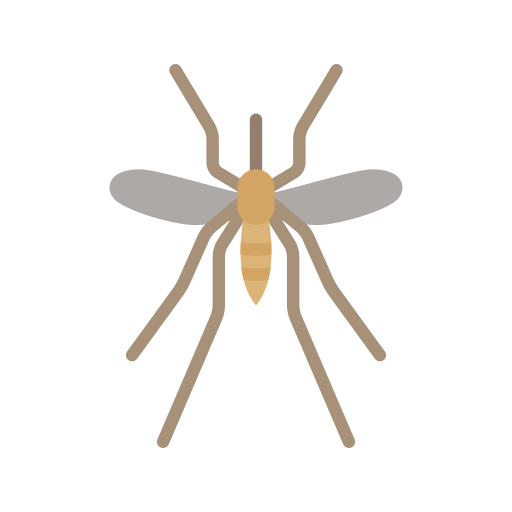
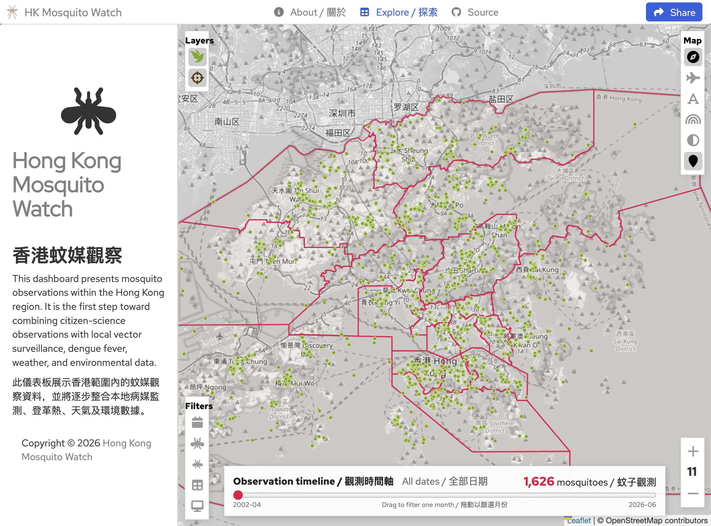
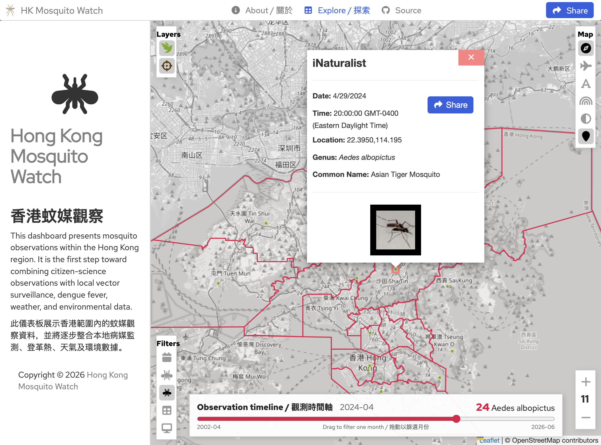
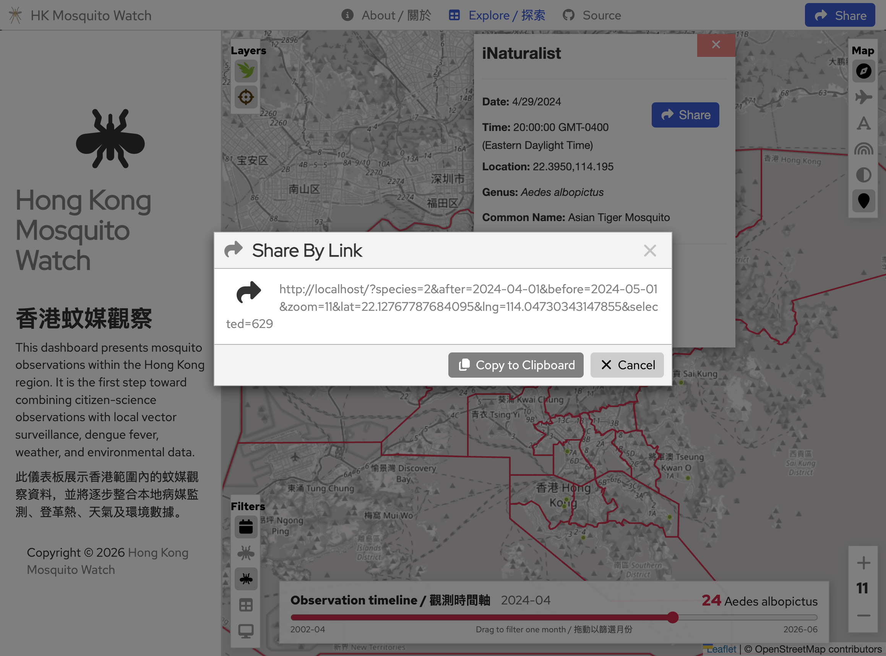

<p align="center">
  <div align="center">
    
  </div>
</p>

# Hong Kong Mosquito Watch Dashboard

Hong Kong Mosquito Watch (HKMW) displays mosquito observations within the official Hong Kong administrative boundary.


*Global View*


*Observation View*


*Share By Link View*

# Capabilities
The HKMW dashboard includes the following features.

### Data Sources
The dashboard currently integrates:

- [iNaturalist](https://www.inaturalist.org)
- [FEHD](https://www.fehd.gov.hk/tc_chi/pestcontrol/dengue_fever/Dengue_Fever_Gravidtrap_Index_Update.html)
- [Hong Kong Observatory](https://www.hko.gov.hk/tc/abouthko/opendata_intro.htm)

### Viewing
- View locations of mosquito observations on a map.
- View data and metadata for individual observations.
- View full screen slide shows of observation imagery.
- Select from a variety of base maps.
- Choose between light or dark mode.
- Show monochrome or colored base maps to highlight the markers or the geography.

### Filtering:
- Filter observations by:
    - Data Source
    - Date / Time
    - Genera
    - Species

### Collaboration
- Easily share observations and map views with others by clicking the "Share" button.  This will create a web link that you can share with others that captures your current view and application settings.

## Architecture

This application is composed of three main parts:

### 1. Scraper
The scraper pulls data from the citizen science platforms into a database where it can be used by this applicsation. Typically, the scraper is configured to perform a period scraper (once per day) to keep the database up to date.

### 2. Server
The server provides observation data to the client application.  It listens for http requests, pulls the data from the SQL database, and provides the data in the format needed by the client.

### 3. Client
The client is the dashboard front end application that users see in their web browser.   It displays a map view, requests data from the server and displays the data in a visual form.

## Installation

### 1. Docker Installation
The application has been "Dockerized" to make it easy to install and run.   To run the application, you must first have Docker installed on your machine / web server and then you can just run the following command to run the application:

```
sh run.sh
```

After running this command, you should be able to view the application in your web browser by going to the address: "localhost".

## License

Distributed under the MIT License. See `LICENSE` for more information.

## Contact

Hanzhi Chen - PhD student, Department of Biomedical Science, City University of Hong Kong
(mailto:hanzhchen7-c@my.cityu.edu.hk)

